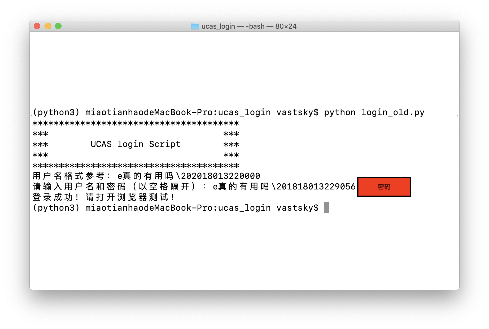
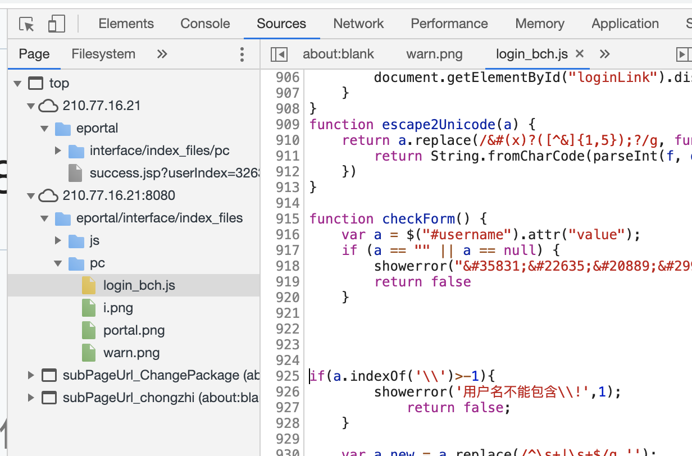

# UCAS-Network-Login
A python program that helps you log in UCAS network for free. 免费自动登录国科大校园网 <br/>
声明：本软件不会收集你的任何信息，即使保存密码也都是保存在本地。<br/>
软件编写思想是模拟浏览器填充用户名和加密后的密码，发送认证消息。
## 使用说明
旧版程序截图：


为了方便大家使用，我将程序打包成exe可执行程序（windows系统）和exec（mac、ubuntu等类unix系统）。<br/>
请对应下载可执行文件，运行即可。<br/>
对应表如下：

| 系统 | 文件 | 说明 |
| :------: | :------: | :------: |
| Windows | login.exe | 会自动保存密码 |
| Windows | login_old.exe | 不会自动保存密码 |
| Mac OS | login | 会自动保存密码 |
| Mac OS | login_old | 不会自动保存密码 |
| Ubuntu | login | 会自动保存密码 |
| Ubuntu | login_old | 不会自动保存密码 |


为了更加方便简洁，将密码保存在本地。初次使用需要输入用户名和密码，其会自动保存在相同目录下的`conf.ini`文件中。
内容参考如下：

```editorconfig
[Default]
username = e真的有用吗\201818013220000
password = 000000
```
如果不小心输入了错误的用户名或密码，直接修改`conf.ini`中的用户名及密码。或者直接删除`conf.ini`，重新运行程序。
## 源码安装 Install from code
环境需求：python3.5 or python3.6<br/>
依赖`request`和`execjs`<br/>
安装步骤，在系统终端里执行。windows为cmd，Mac和Ubuntu为bash终端。
```bash
pip install requests
pip install pyexecjs
```
## 执行 Exec
在系统终端里执行。windows为cmd，Mac和Ubuntu为bash终端。
```bash
python login.py
```
输入用户名和密码，要以空格隔开。

## 手动登陆法
* 用谷歌Chrome浏览器或者Microsoft Edge打开`210.77.16.21`网址
* 进入开发者模式，然后找到`210.77.16.21:8080`文件夹下`eportal/interface/index_files`
* 找到`pc`目录下，`login_bch.js`文件
* 删除925至928行代码
```
if(a.indexOf('\\')>-1){
  		showerror('用户名不能包含\\!',1);
			return false;
  	}
```

* 保存（windows下ctrl+s），并在浏览器内输入用户名和密码。记住保存更改后，不能刷新登陆界面。

参考了MAC版登录器Uon，感谢Chriskuei
https://github.com/Chriskuei/Uon-for-Mac <br/>
以及Ios版，https://github.com/Chriskuei/Uoner


